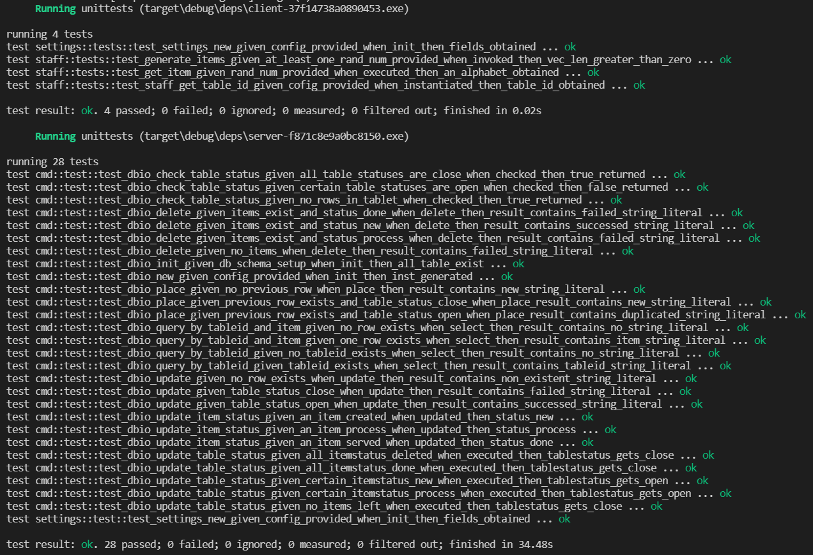
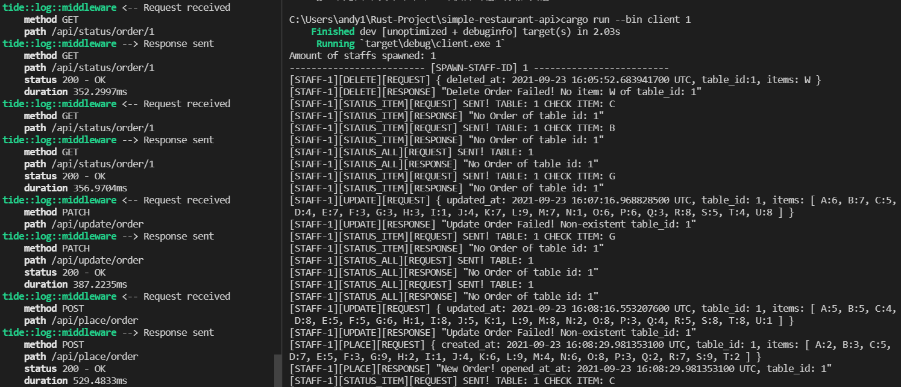

# Simple Restaurant API
## Introduction
The project is developed for the [interview problem](https://github.com/paidy/interview/blob/master/SimpleRestaurantApi.md) of [Paidy Inc.](https://paidy.com/), in order to realize a simple food ordering system in a restaurant. The APIs aim to place/delete/update/query orders on demand with some added rules.
## REST API Specifications

| Description                                                                                                                                                                          | Method | Basic Auth (Y/N) |               path                |
| :----------------------------------------------------------------------------------------------------------------------------------------------------------------------------------- | :----: | :--------------: | :-------------------------------: |
| Show all items for a specified table number                                                                                                                                          |  GET   |        N         |    /api/status/order/:table_id    |
| Show a specified item for a specified table number                                                                                                                                   |  GET   |        N         | /api/status/order/:table_id/:item |
| Create a request: store item, table number and cooking period                                                                                                                        |  POST  |        Y         |         /api/place/order          |
| Delete a request: remove a specified item for a specified table number                                                                                                               | DELETE |        Y         |         /api/delete/order         |
| Update a request: for a created request not fully served, a staff is able to update amounts of specified items and add new items on the same order, but served items are not updated | PATCH  |        Y         |         /api/update/order         |

```table_id```: The identifier of a table, which is unique.

```item```: The name of the food. In our scenario, it is limited to upper-case alphabets: **(A, B, C, ... , X, Y, Z)**.

```Base URL```: localhost:8080

## Prerequisites
- **Database Version**

    In my project, [PostgreSQL 13.4 database](https://www.postgresql.org/) is applied , try update your database to [latest version ](https://www.postgresql.org/download/) here.

- **[Client Configurations](./client/config/production.toml)**
    ```toml
    [client]
    base_url = "http://127.0.0.1:8080"
    timeout = 3 # secs
    
    [api]
    place_order = "/api/place/order"
    delete_order = "/api/delete/order"
    update_order = "/api/update/order"
    status_order = "/api/status/order"
    
    [auth]
    username = "ee275d64dafcd283c25b00a66fb771834a2c2bfb1a7b472b67cf59fd6936254f"
    password = "0eea143ee0f08fd0b7fbf5e9bf9032f0125da321f9290c1273271bca9157b73a"
    ```
    It depends on requirements to revise fields ```base_url``` and ```timeout``` if you would like to send requests to specified host or would like to change timeout period. It matters not to change ```[api]``` and ```[auth]``` sections becasue the former provides the descriptions of api while the latter is adopted for the basic authentication when sending ```POST```, ```DELETE```, and ```PATCH``` requests. 
    
    Nontheless, if you'd like to know what would happen once ```[auth]``` section is modified, I encourage you to try it but remember to roll it back. Server-side application is able to handle un-authorized requests safely.
- **[Server Configurations](./server/config/production.toml)**
    ```toml
    [server]
    ip = "127.0.0.1"
    port = "8080"
    
    [database]
    prefix = "postgresql://postgres"
    password = "test"
    ip = "localhost"
    port = "5432"
    db_name = "restaurant"
    ```
    It is emphasized that the contents in ```[server]``` section should be consistent to that in ```[client]``` section. Remember to modify both if you'd like to run the application on other hosts. Aside from that, anyone who wants to test needs to install [PostgreSQL database](https://www.postgresql.org/download/) and configure corresponding fields in ```[database]``` section. Bear in mind that fields in the file should be coherent to the configuration of the database.
    
    On top of that, you have to create a db schema ```restaurant``` on your database, or it might cause error when the application fails to connect to specified location.
    
    
## Basic Testing Samples
Usually, you can test on your own by [curl](https://linux.die.net/man/1/curl) command
1. **Get all items of a specified table number**.
   
   ```curl -X GET -H "Content-Type:application/json" localhost:8080/api/status/order/3```
   
2. **Get status of a specified item of a specified table number**.
   
   ```curl -X GET -H "Content-Type:application/json" localhost:8080/api/status/order/3/Z```

3. **Create a new request for aquiring items of a specific table**.

    ```curl -X POST -H "Content-Type:application/json" -H "X-Auth-Username:{username}" -H "X-Auth-Password:{password}" localhost:8080/api/place/order -d "{JSON Request}"```
    
    JSON Request Format:
    ```json
    {
    	"timestamp": 1234567890123,
    	"table_id":"4",
    	"items": [
    		{"name":"A", "amount":1},
    		{"name":"B", "amount":2},
    		{"name":"C", "amount":3}
    	]
    }
    ```
    Note that fields ```{username}``` and ```{password}``` are configured in file [```client/config/production.toml```](./client/config/production.toml)
    Besides that, if you are testing on Windows platforms, slashes ```\``` might be added to skip quotes ```"```.
    
    ```json
    {
        \"timestamp\":1234567890123,
        \"table_id\":\"4\",
        \"items\": [
            {\"name\":\"A\", \"amount\":1}, 
            {\"name\":\"B\", \"amount\":2}, 
            {\"name\":\"C\", \"amount\":3}
        ]
    }
    ```
    In the example, we are going to order items {A, B, C} with amount {1, 2, 3} respectively, for table id 4.

4. **Remove an item from a list of a specific table id**.

    ```curl -X DELETE -H "Content-Type:application/json" -H "X-Auth-Username:{username}" -H "X-Auth-Password:{password}" localhost:8080/api/delete/order -d "{JSON Request}"```

    JSON Request Format:
    ```json
    {
        "timestamp": 1234567890123,
        "table_id": "4",
        "item": "A"
    }
    ```
    
    Note that fields ```{username}``` and ```{password}``` are configured in file [```client/config/production.toml```](./client/config/production.toml)
    Besides that, if you are testing on Windows platforms, slashes ```\``` might be added to skip quotes ```"```.
    ```json
    {
        \"timestamp\": 1234567890123,
        \"table_id\": \"4\", 
        \"item\": \"A\"
    }
    ```
    For example, we would like to delete item: A of table id: 4.
5. **Update one or more items of a specific table**.

    ```curl -X PATCH -H "Content-Type:application/json" -H "X-Auth-Username:{username}}" -H "X-Auth-Password:{password}" localhost:8080/api/update/order -d "{JSON Request}"```

    JSON Request Format:
    ```json
    {
        "timestamp": 1234567890123,
        "table_id": "4",
        "items": [
            { "name": "A", "amount": 8 },
            { "name": "B", "amount": 3 }
        ]
    }
    ```
    
    Note that fields ```{username}``` and ```{password}``` are configured in file [```client/config/production.toml```](./client/config/production.toml)
    Besides that, if you are testing on Windows platforms, slashes ```\``` might be added to skip quotes ```"```.
    
    ```json
    {
        \"timestamp\":1234567890123,
        \"table_id\":\"4\",
        \"items\": [
            {\"name\":\"A\", \"amount\":8},
            {\"name\":\"B\", \"amount\":3}
        ]
    }
    ```
    For example, if you'd like to update the amount of an item that is in **neither ```done``` nor ```doing```** state. The order would be rejected if the specified item is not in **```todo```** state. You can only wait for the table status to be done; relaucn a new order.
## Order Rules
Considering COVID-19 situation, we have proposed some revised rules for customers to order to avoid consumption of redundant food. 

1. If a table is fully served, a staff could help customers place a new order with both table id and specified items/amounts.
2. If you'd like to delete a certain item on your order, please tell our staffs for assistance. However, for items that have been ```doing``` or ```done```. We would not serve the requests.
3. To check all items' preparation status of your table, ask our staffs to do it for you.
4. To check a certain item's status of your table, ask our staffs to do it for you.
5. To update your original order, we only allow 
    
    [1] items still in ```todo``` state 
    
    [2] new items haven't been requested
    
    to be updated on the order waiting for service.
## DB Schema Design


In realistic scenarios, there is a one-to-many mapping between each table and ordered items since each table might contain many items. As a result, I associate both by field ```table_id```. Detailed description of fields is indicated as follows:

| tablet field | timestamp              | table_id      | table_status                                                                      |
| :----------: | :--------------------- | :------------ | :-------------------------------------------------------------------------------- |
| description  | The ordered time (UTC) | id of a table | serving status of a table, usually in ```todo```, ```doing``` or ```done``` state |

| items field | timestamp              | table_id      | item                                             | amount            | item_status                                                                       |
| :---------: | :--------------------- | :------------ | :----------------------------------------------- | :---------------- | :-------------------------------------------------------------------------------- |
| description | The ordered time (UTC) | id of a table | item name, limited to upper-case alphabet (A..Z) | amount of an item | serving status of an item, usually in ```todo```, ```doing``` or ```done``` state |

Let's compare some terms associative with order results you would see in the db schema.

|         -          | ```todo```                                    | ```doing```                                   | ```done```           |
| :----------------: | :-------------------------------------------- | :-------------------------------------------- | :------------------- |
| ```item_status```  | waiting to be served                          | being served                                  | served               |
| ```table_status``` | all items of a table are waiting to be served | one or more items of a table are being served | all items are served |
## Unit Tests
In the project, there are many unit tests regarding to db access operations. In order to prevent interference from each other because of parallelism of test runner, which means it would concurrently launch thread per unit-test at the same time. Therefore, please follow the instruction below to validate correctness of function units.

```cmd
cargo test -- --test-threads=1
```

In order to avoid unexpected results caused by concurrent access from different threads of unit-test cases, only 1 thread is adopted to run test cases sequentially. The result should be as below:



Note that there is a writing format for describing the relation among function names, scenarios and expected results as follows:

```
test_[module name]_[function name]_given_[pre-condition]_when_[action]_then_[expected result]
```
## Build & Launch the Application
The project contains both ```server-side``` and ```client-side``` applications. The former simulates the back house of a restaurant dealing with orders received from staffs while the latter launches multiple tablets responsible for ```placing```/```deleting```/```updating```/```querying``` orders from customers.

To get an overview of the project, refer to [Cargo.toml](./Cargo.toml) in the root directory

```toml
[workspace]
members = ["server", "client"]
```

As you see, there are primarily 2 subprograms, ```server``` and  ```client```. To compile them respectively, apply instructions as below:

```cmd
cargo build --bin server
```
```
cargo build --bin client
```

Similarly, when you are going to lauch both applications, follow instructions below:

```cmd
cargo run --bin server
```
```
cargo run --bin client [nums]
```

Note that ```[nums]``` indicates the numbers of staffs serving in the restaurant, which should be a positive integer. If you don't specify them or pass a non-positive integer to it, the client process would panic!
## Notice
In the homework requirement, each item is given a random amount of time between 5 and 15 minutes to complete. 

To rapidly show the result for each request, I would assign each item 5 to 15 seconds to prepare. (You could refer it as minute-level)

Lastly, for each staff serving customers, they would randomly send a request of different types per second.



## Graceful Shutdown
To guarantee customers' rights are protected, our system is designed to handle unexpected shutdown. Once it occurrs, the system would be waiting for the rest orders to be fully served till shutdown; other incoming requests are to be rejected due to emergencies.


## Other Issues
There are still some other topics we could take into account in the future from perspectives of behavior recording, malicious attack, identifier authentication, etc.
- **Logger**
To demonstrate request-response behavior, message would be directed to console that would dimish system performance due to I/O behavior. In my opinion, a logger should be adopted to record behavior of restaurant/customers and direct them to another filesystem because these messages are usually not mission-critical.

- **Request Rate Control**
DDoS attack is common when some people are going to break down your system. To prevent this from happening and continue to serve customers, it matters to setup a rate limit (ex: 3 req/sec) for requests from all tables to constrain flow.

- **Identification Authentication**
Any ```POST```, ```DELETE``` or ```PATCH``` request is able to modify the state of the database, so only authorized staffs, rather than other strangers, can use them. In my project, I only applied ```basic username/password authentication``` for each staff, which is still insufficient. Ideally, each staff should acquire an OTP (One-Time Password) as a token to pass the request handling.